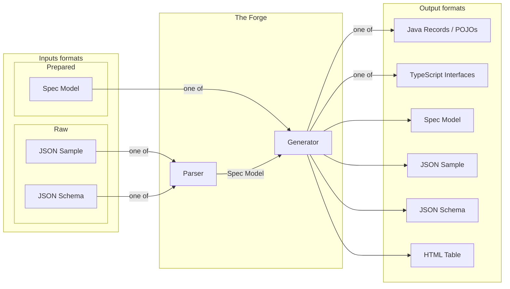

# 🛠 Spec-Forge API


[](https://sonarcloud.io/dashboard?id=volodymyr-oleksiienko_spec-forge-api)
[](https://sonarcloud.io/component_measures?id=volodymyr-oleksiienko_spec-forge-api&metric=coverage&view=list)


**Spec-Forge API** is an engine designed to transform raw data sources like **JSON examples** and **JSON schemas** into
a unified **Intermediate Representation (IR)**. This IR is then used to generate clean, production-ready **Java** and
**TypeScript** codebases.

---

## 🚀 Quick Start

### 📋 Prerequisites

Ensure you have the following environment configurations before starting:

* **Java 25+**

### 💻 Run Locally

Execute the following commands in your terminal to clone the repository and start the service:

```bash
# Clone the repository
git clone https://github.com/volodymyr-oleksiienko/spec-forge-api.git

# Navigate into the project directory
cd spec-forge-api

# Build application using the Maven Wrapper
./mvnw clean install

# Run the application using the Maven Wrapper
./mvnw spring-boot:run -pl spec-forge-api-infra
```

Once the application has started, the API will be available at:
> `http://localhost:8080`


Application health check available at:
> `http://localhost:8080/actuator/health`

## 📡 API Reference

### 1. Generate SpecModel (IR) from JSON Schema

**Endpoint:** `POST /artifacts/from-json-schema`  
**Content-Type:** `application/json`

**Request Body:**

```json
{
  "content": "{\"type\": \"object\", \"properties\": {\"id\": {\"type\": \"integer\"}}}"
}
```

### 2. Generate SpecModel (IR) from JSON Sample

**Endpoint:** `POST /artifacts/from-json-sample`  
**Content-Type:** `application/json`

**Request Body:**

```json
{
  "content": "{\"id\": 123}"
}
```

### Response (Success 200 OK)

Returns the standardized SpecModel and any warnings.

```json
{
  "specModel": {
    "wrapperType": "OBJECT",
    "properties": [
      {
        "name": "id",
        "type": {
          "type": "INTEGER"
        },
        "required": false
      }
    ]
  },
  "jsonSample": "{\"id\": \"1\"}",
  "jsonSchema": "{\"$schema\": \"https://json-schema.org/draft/2020-12/schema\", \"type\": \"object\", \"properties\": { \"id\": { \"type\": \"string\" } } }"
}
```

---

## 🛠 How it Works



---

## 🔄 Conversion Matrix

| Source Format                            | Ingest (to SpecModel) | Generate (from SpecModel) |
|:-----------------------------------------|:---------------------:|:-------------------------:|
| **JSON Example**                         |           ✅           |             ✅             |
| **JSON Schema**                          |           ✅           |             ✅             |
| **Java (Records/POJOs)**                 |           ❌           |             ✅             |
| **TypeScript (Interfaces\Type Aliases)** |           ❌           |             ✅             |

---

## 🧰 Tech Stack

* **Language:** Java 25+
* **Framework:** Spring Boot 4+
* **Build Tool:** Maven 3.9+

---

## 🏛️ Architecture Spec-Forge

Spec-Forge uses a **Ports & Adapters (Hexagonal) architecture** to maintain a **pure business logic core**.

---

### 🛡️ Core

- **Pure Java 25 logic**
- **Zero external dependencies**
- Contains:
    - Intermediate Representation (IR)
    - Transformation rules
- Dependency purity is strictly enforced via **`maven-enforcer-plugin`**

---

### 🔌 Infrastructure

- **Spring Boot**
- Adapters and IO

---

### 🧩 Project Structure

Spec-Forge is built as a Maven Multi-Module project to enforce architectural boundaries.

```
.
├── spec-forge-api-core/      # Pure Business Logic
│   ├── src/main/java         # IR Definitions, Transformation Rules
│   └── pom.xml               # ZERO external dependencies (Enforced)
│
├── spec-forge-api-infra/     # Framework & Adapters
│   ├── src/main/java         # Spring Boot Controllers, IO
│   ├── src/main/resources    # Application Config
│   └── pom.xml               # Depends on core + Spring Boot
│
└── pom.xml                   # Parent POM (Dependency Mgmt)
```

---

## 🔄 CI / CD

- **CI**: GitHub Actions on every push
- **CD (prod)**: triggered by `v*` git tags or manual run
- **Image**: `ghcr.io/volodymyr-oleksiienko/spec-forge-api`
- **Deploy**: Docker Compose on production server
- **Health check**: `/actuator/health`

---

## ⚖️ License

This project is licensed under the **GNU Affero General Public License v3.0 (AGPL-3.0)**.

### Special licensing

If you require **special licensing conditions** (e.g. commercial use, closed-source distribution, or other exceptions),
**you must contact the project author directly** to discuss alternative licensing options.

## 🤝 Contributing

Contributions are welcome! To keep the codebase clean and the history readable, please follow these steps:

### 1. The Workflow

1. Fork the project and create your feature branch:
   ```bash
   git checkout -b feat/amazing-feature
   ```
2. Code your changes.
3. Format your code (see below).
4. Verify everything passes:
   ```bash
   mvn clean verify
   ```
5. Submit a Pull Request.

### 2. Code Style (Linter)

We use **Palantir Java Format** via the **Spotless** plugin.  
The build will fail if the code is not formatted correctly.

To fix formatting automatically, run this command from the project root before you commit:

```bash
mvn spotless:apply
```

IDE Setup: If you use IntelliJ, install the **Palantir Java Format** plugin and enable **Reformat on Save** to handle
this automatically.

### 3. Automated Checks

Every Pull Request triggers a CI pipeline to ensure code integrity:

- **Style Enforcement (All Branches):** The build will fail immediately if code does not adhere to the **Palantir Java
  Format** (checked via Spotless).
- **Verification:**
    - **Main Branch:** Fast-path verification of compilation and unit tests.
    - **Develop Branch:** Full deep-scan including **SonarCloud** static analysis and **JaCoCo** coverage reports.